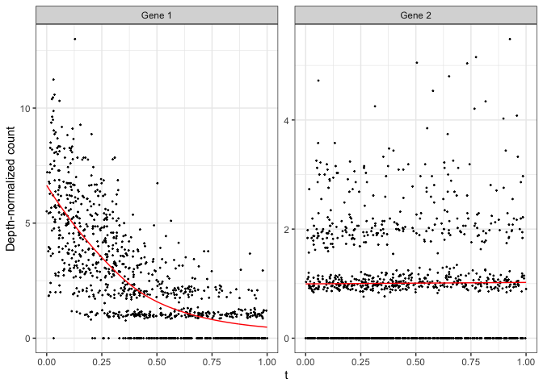

MorphoGAM: Detect spatially variable genes by projecting to
morphologically relevant curves
================
R package version 1.1.0

## System Requirements

`R` is required to use `MorphoGAM`. In development, `R` version 4.3.0
and greater were used, but there may be compatibility with previous
versions.

## Installation

From the R console,
`devtools::install_github("phillipnicol/MorphoGAM")`. Installation
should take less than a minute on a standard machine.

## Demo

This demonstration should complete in a few minutes on a standard computer. 

### Step 1: Estimate morphologically relevant coordinates

The first step in running `MorphoGAM` is to define a curve from which
the morphologically relevant coordinates are defined. To demonstrate
this, we use the swiss roll example:

``` r
set.seed(1)
library(MorphoGAM)
library(tidyverse)
xy <- MorphoGAM:::makeSwissRoll()
data.frame(x=xy[,1],y=xy[,2]) |> ggplot(aes(x=x,y=y)) + 
  geom_point(size=0.5) + theme_bw()
```

<!-- -->

The function `CurveFinder()` applies the automatic curve estimation
method

``` r
fit <- CurveFinder(xy)
```

The `fit` object contains plots of the first two morphologically
relevant coordinates and the fitted curve:

``` r
fit$curve.plot
```

<!-- -->

``` r
fit$coordinate.plot #First morphologically relevant coordinate 
```

<!-- -->

``` r
fit$residuals.plot #Second morphologically relevant coordinate
```

<!-- -->

The morphologically relevant coordintes can be accessed via `fit$xyt`:

``` r
fit$xyt |> head()
```

    ##            x          y         t         r         f1         f2
    ## 1 -0.5570179  0.3213394 0.2050271 0.4133826 -0.5474196  0.3125001
    ## 2 -0.5829042 -0.4035348 0.2980582 0.4115648 -0.5730570 -0.3944718
    ## 3  0.6330314 -0.3873620 0.4895029 0.7098784  0.6685151 -0.4089267
    ## 4 -0.8982847  0.2923785 0.8824209 0.6039158 -0.9116261  0.3098966
    ## 5 -0.2294434  0.5582292 0.1530027 0.4402809 -0.2343397  0.5517795
    ## 6 -0.8106100  0.3995968 0.8657898 0.6428067 -0.8339070  0.4171639

In some cases the user may wish to draw the curve by hand. For this we
provide an interactive shiny app that can be run locally using the
function `CurveFinderInteractive()`. Once the app is running you can
click the sequence of points defining the curve, then press the “Smooth”
button to fit the curve. Once the smoothing is done the app can be
closed and `fit` will be returned.

``` r
  #Running this opens a shiny app
  fit <- CurveFinderInteractive(xy)
```

### Step 2: Apply GAM to morphologically relevant coordinates

The next step is to identify genes with variable expression along the
curve (or in the orthogonal direction). Here we generate a synthetic
count matrix `Y` with one spatially interesting gene:

``` r
Y <- matrix(rpois(100*nrow(xy), lambda=1),
            nrow=100, ncol=nrow(xy))

eta <- -3*fit$xyt$t + 2
Y[1,] <- rpois(nrow(xy),lambda=exp(eta))

rownames(Y) <- paste("Gene", 1:nrow(Y))
```

Now we apply the generalized additive model (GAM):

``` r
mgam <- MorphoGAM(Y, curve.fit=fit,
                  design = y ~ s(t, bs="cr"))
```

    ## ================================================================================

    ## Warning in irlba::irlba(fxs.r): fast code path error starting vector near the
    ## null space; re-trying with fastpath=FALSE.

    ## Error in irlba::irlba(fxs.r) : starting vector near the null space

The `bs = "cr"` specifies cubic regression splines in the GAM, although
this can be modified to periodic splines or other basis functions
provided by `mgcv`. We may wish to sort the results matrix to rank genes
by summaries of the estimated function:

``` r
mgam$results |> arrange(desc(peak.t)) |> head()
```

    ##             peak.t    range.t         pv.t peak.r range.r pv.r intercept
    ## Gene 1  1.18349653 5.40344926 0.0000000000      0       0    0 -3.953473
    ## Gene 33 0.10195765 0.18728675 0.0002472835      0       0    0 -4.618065
    ## Gene 20 0.06313620 0.11151799 0.0063965136      0       0    0 -4.647023
    ## Gene 49 0.04881890 0.05290388 0.0506582449      0       0    0 -4.682800
    ## Gene 16 0.03538251 0.04356503 0.0392955411      0       0    0 -4.610617
    ## Gene 10 0.03233560 0.03115972 0.2185367051      0       0    0 -4.645891

The results indicate gene $1$ has a significant peak and range (region
of increased expression), and we can visually confirm this by using
`plotGAMestimate()` to plot the entire function:

``` r
plotGAMestimates(Y,genes=c("Gene 1", "Gene 2"),
                 mgam_object = mgam,
                 curve_fit=fit,
                 type="t")
```

<!-- -->

To also identify genes that vary in the direction of the second
morphologically relevant coordinate, add the term `s(r, ...)` to the
`design` argument in `MorphoGAM`.

``` r
mgam_with_r <- MorphoGAM(Y, curve.fit=fit,
                          design = y ~ s(t, bs="cr") + s(r, bs="cr"))
```

## Reference

If you use `MorphoGAM` in your work, please cite:
