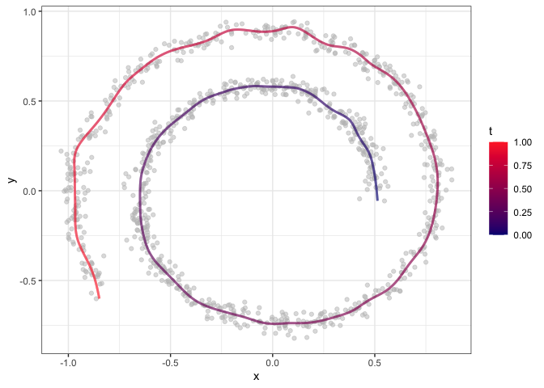
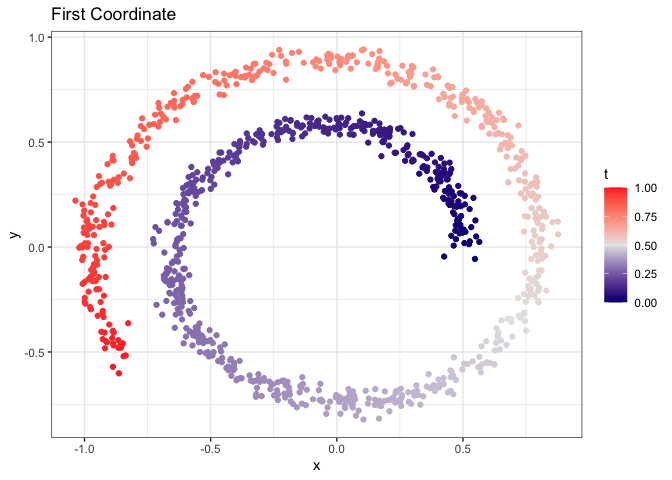
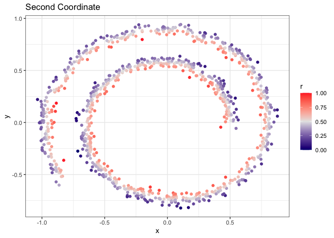

MorphoGAM: Detect spatially variable genes by projecting to
morphologically relevant curves
================
R package version 1.0.0

## System Requirements

`R` is required to use `MorphoGAM`. In development, `R` version 4.3.0
and greater were used, but there may be compatibility with previous
versions.

## Installation

From the R console,
`devtools::install_github("phillipnicol/MorphoGAM")`. Installation
should take less than a minute on a standard machine.

## Demo

The first step in running `MorphoGAM` is to define a curve from which
the morphologically relevant coordinates are defined. To demonstrate
this, we use the swiss roll example:

``` r
set.seed(1)
library(MorphoGAM)
library(tidyverse)
xy <- MorphoGAM:::makeSwissRoll()
data.frame(x=xy[,1],y=xy[,2]) |> ggplot(aes(x=x,y=y)) + 
  geom_point(size=0.5) + theme_bw()
```

<!-- -->

The function `CurveFinder()` applies the automatic curve estimation
method

``` r
fit <- CurveFinder(xy)
```

The `fit` object contains plots of the first two morphologically
relevant coordinates and the fitted curve:

``` r
fit$curve.plot
```

<!-- -->

``` r
fit$coordinate.plot
```

<!-- -->

``` r
fit$residuals.plot
```

<!-- -->

To interactively specify the curve, use the following function. Press
the “Smooth” button when the points have been specified and then close
the app to obtain the result:

``` r
  #Running this opens a shiny app
  fit <- CurveFinderInteractive(xy)
```

The next step is to identify genes with variable expression along the
curve (or in the orthogonal direction). Here we generate a synthetic
count matrix `Y`:

``` r
Y <- matrix(rpois(100*nrow(xy), lambda=1),
            nrow=100, ncol=nrow(xy))

eta <- -3*fit$xyt$t + 2
Y[1,] <- rpois(nrow(xy),lambda=exp(eta))

rownames(Y) <- paste("Gene", 1:nrow(Y))
```

Now we apply the generalized additive model (GAM):

``` r
mgam <- MorphoGAM(Y, curve.fit=fit,
                  design = y ~ s(t, bs="cr"))
```

    ## ================================================================================

The `bs = "cr"` specifies cubic regression splines in the GAM, although
this can be modified to periodic splines or other basis functions
provided by `mgcv`. We may wish to sort the results matrix to rank genes
by summaries of the estimated function:

``` r
mgam$results |> arrange(desc(peak.t)) |> head()
```

    ##            peak.t   range.t         pv.t peak.r range.r pv.r intercept
    ## Gene 1  1.4270898 6.1790340 0.0000000000      0       0    0 -3.953473
    ## Gene 10 0.2789934 0.3209224 0.2185367050      0       0    0 -4.645891
    ## Gene 44 0.2689231 0.5115989 0.0924200551      0       0    0 -4.593755
    ## Gene 49 0.2296414 0.2818365 0.0506582449      0       0    0 -4.682800
    ## Gene 33 0.2162688 0.4054366 0.0002472835      0       0    0 -4.618065
    ## Gene 64 0.2151618 0.3072443 0.1074942791      0       0    0 -4.623618

The results indicate gene $1$ has a significant peak and range (region
of increased expression), and we can visually confirm this by using
`plotGAMestimate()` to plot the entire function:

``` r
plotGAMestimates(Y,genes=c("Gene 1", "Gene 2"),
                 mgam_object = mgam,
                 curve_fit=fit,
                 type="t")
```

<!-- -->

To also identify genes that vary in the direction of the second
morphologically relevant coordinate, add the term `s(r, ...)` to the
`design` argument in `MorphoGAM`.

``` r
mgam_with_r <- MorphoGAM(Y, curve.fit=fit,
                          design = y ~ s(t, bs="cr") + s(r, bs="cr"))
```

## Reference

If you use `MorphoGAM` in your work, please cite:
