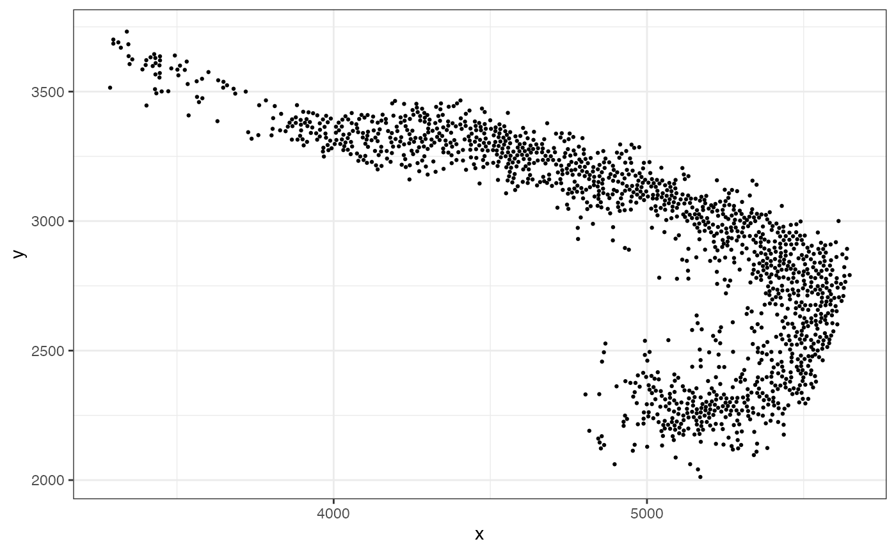
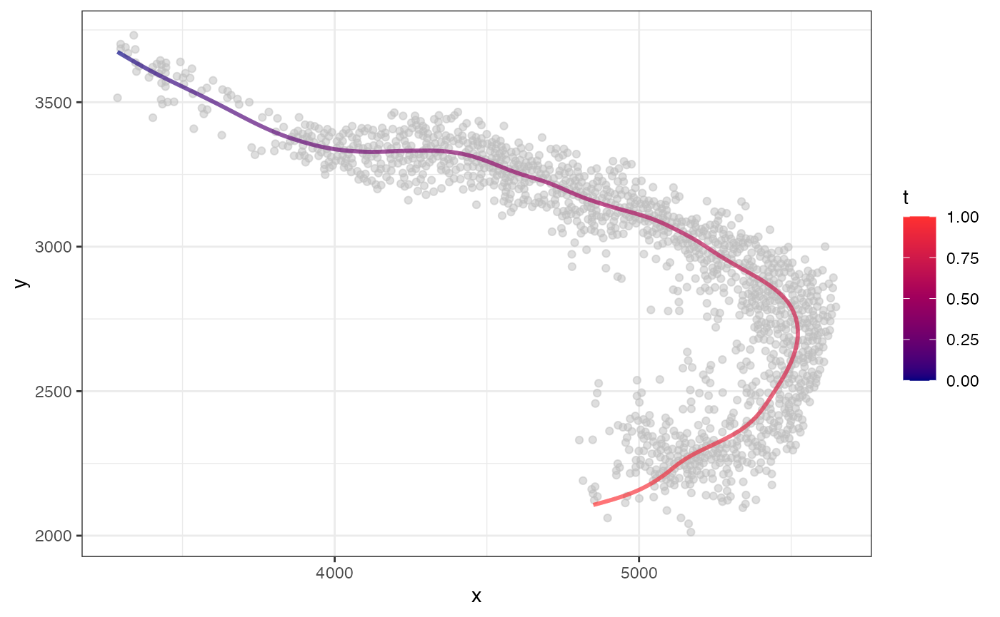
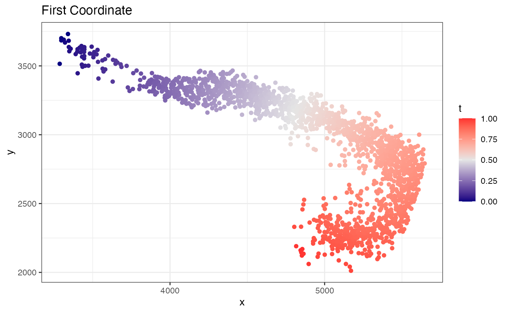
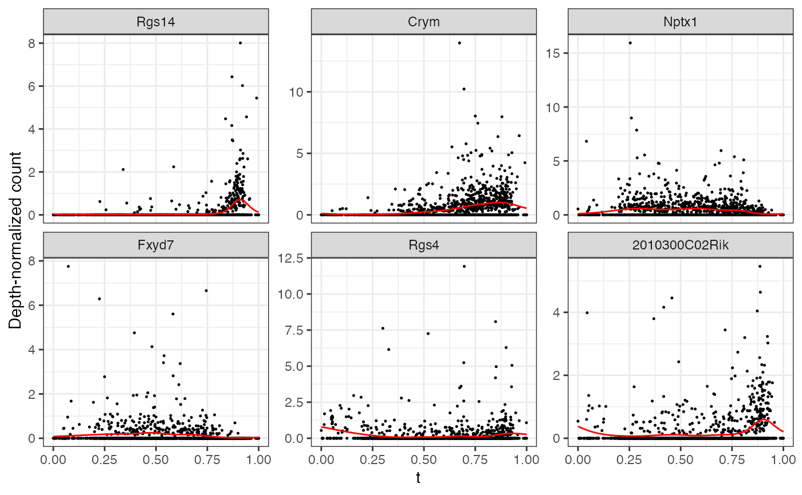
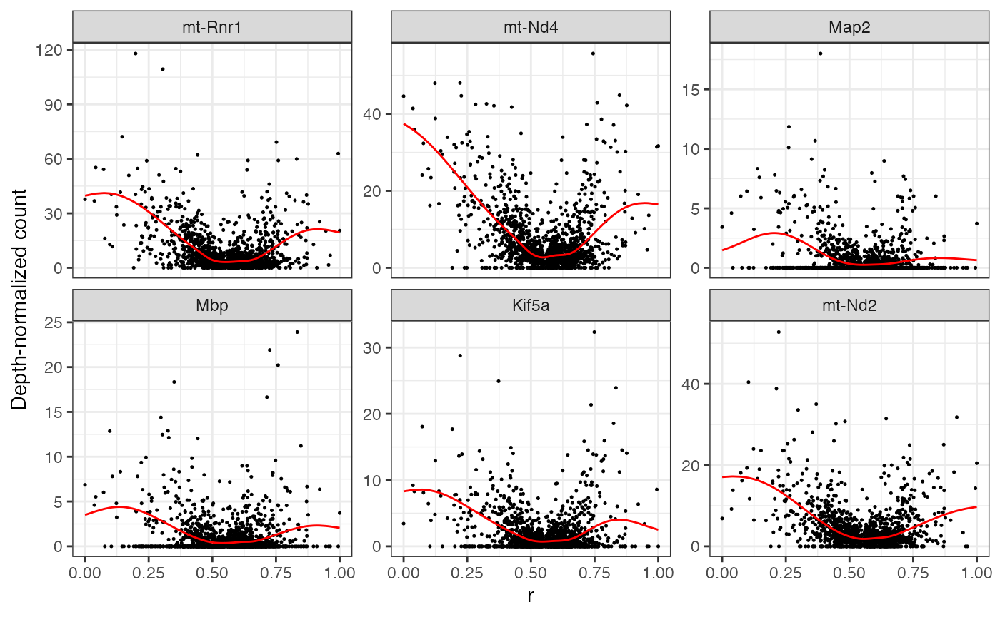
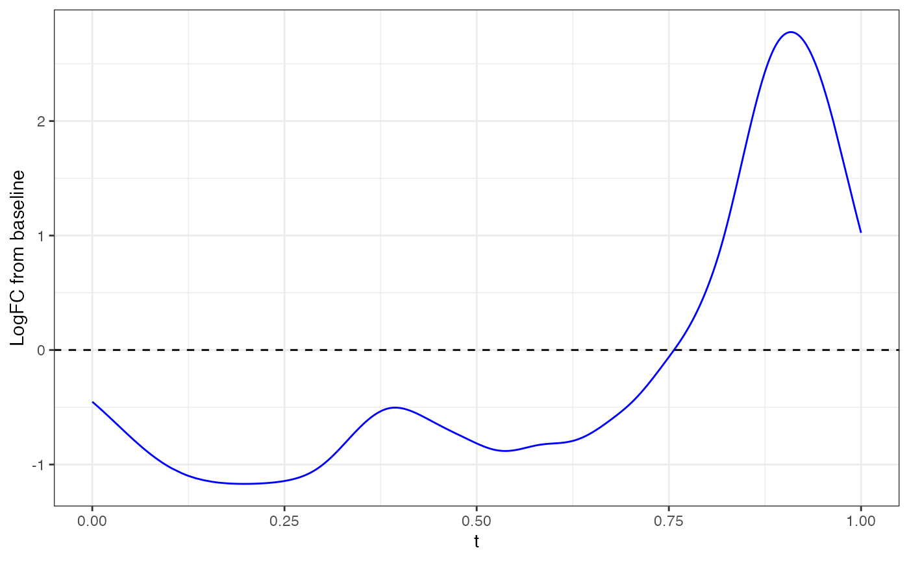
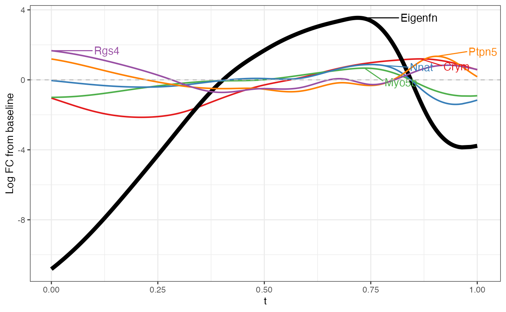

# Slide-seq Mouse Hippocampus

In this analysis, we will use `MorphoGAM` to analyze CA3 cells in the
mouse hippocampus.

First, we load the necessary packages.

``` r

library(MorphoGAM)
library(dplyr)
library(STexampleData)
library(igraph)
library(tidyverse)
```

Next, we load the data and remove outlier points:

``` r

spe <- STexampleData::SlideSeqV2_mouseHPC()
#> see ?STexampleData and browseVignettes('STexampleData') for documentation
#> loading from cache

ixs <- which(spe$celltype == "CA3") #subset to CA3

xy <- spatialCoords(spe)[ixs,]
Y <- counts(spe)[,ixs]

xy.dist <- as.matrix(dist(xy))
knn <- 20
prune.outlier <- 3
nnk <- apply(xy.dist, 1, function(x) sort(x)[knn+1])
outlier <- which(nnk > (prune.outlier)*median(nnk))

xy <- xy[-outlier,]; Y <- Y[,-outlier]

data.frame(x=xy[,1], y=xy[,2]) |> ggplot(aes(x=x,y=y)) + 
  geom_point(size=0.5) + theme_bw()
```



Now, we can fit a 1D curve passing through and observe the resulting
coordinates:

``` r

fit <- CurveFinder(xy)
fit$curve.plot
```



``` r

fit$coordinate.plot
```



`fit$xyt` also includes the values. Now to find variable genes along
this path, we can use the
[`MorphoGAM()`](https://phillipnicol.github.io/MorphoGAM/reference/MorphoGAM.md)
function. For speed, let’s first subset to 2000 variable genes

``` r

# Find 2000 variable genes based 

logCPM <- log2(1e6*(Y/Matrix::colSums(Y)) + 1)
var.genes <- names(sort(apply(logCPM, 1, var), decreasing=TRUE))[1:2000]

Y <- as.matrix(Y[var.genes,])
```

Now we fit the model. In the `design` argument, we specify that we want
a model that fits a smooth function to both the $`t`$ (first coordinate)
and $`r`$ (second coordinate).

``` r

mgam <- MorphoGAM(Y, curve.fit=fit,
                  design = y ~ s(t) + s(r))
#> ================================================================================
```

The first thing we can do is look at genes with a large peak in the
$`t`$ direction. Here, the peak statistic is defined as the maximum log
fold change from the baseline.

``` r

mgam$results |> arrange(desc(peak.t)) |> head()
#>                 peak.t   range.t pv.t     peak.r     range.r        pv.r
#> Rgs14         2.550284 0.5372700    0 0.04681645 0.002330054 0.052910229
#> Crym          1.780810 0.8262077    0 0.24049310 0.086002741 0.001035907
#> Nptx1         1.242108 0.3985731    0 0.10212920 0.048583655 0.033328692
#> Fxyd7         1.241497 0.1649041    0 0.00000000 0.000000000 0.841852436
#> Rgs4          1.240406 0.4118241    0 0.00000000 0.000000000 0.482172509
#> 2010300C02Rik 1.224445 0.4064860    0 0.00000000 0.000000000 0.449048558
#>               intercept
#> Rgs14         -9.460481
#> Crym          -7.529614
#> Nptx1         -7.398298
#> Fxyd7         -8.632202
#> Rgs4          -8.251157
#> 2010300C02Rik -8.256013

top6 <- mgam$results |> arrange(desc(peak.t)) |> head() |> rownames()
```

Note that any list of genes can always be plotted with
[`plotGAMestimates()`](https://phillipnicol.github.io/MorphoGAM/reference/plotGAMestimates.md).

``` r

plotGAMestimates(Y, genes=top6, curve_fit=fit, mgam_object=mgam, nrow=2)
```

 Repeating the same for
the $`r`$ direction:

``` r

top6 <- mgam$results |> arrange(desc(peak.r)) |> head() |> rownames()

plotGAMestimates(Y, genes=top6, curve_fit=fit, mgam_object=mgam, nrow=2, type="r")
```



Note that these statistics are defined for convenience, but the entire
function is available in the output of
[`MorphoGAM()`](https://phillipnicol.github.io/MorphoGAM/reference/MorphoGAM.md).
Example, with Rgs14 gene:

``` r

gene <- "Rgs14"

fitted_function <- mgam$fxs.t[gene,]

data.frame(x=fit$xyt$t, y=fitted_function) |> ggplot(aes(x=x,y=y)) + 
  geom_line(color="blue") + theme_bw() + geom_hline(yintercept = 0, linetype="dashed") + xlab("t") + ylab("LogFC from baseline")
```



Finally, we can look at the FPC loadings. Here, we plot the second FPC
loading in the $`t`$ direction.

``` r

plotFPCloading(mgam_object = mgam,
               curve.fit = fit,
               L=2)
```


