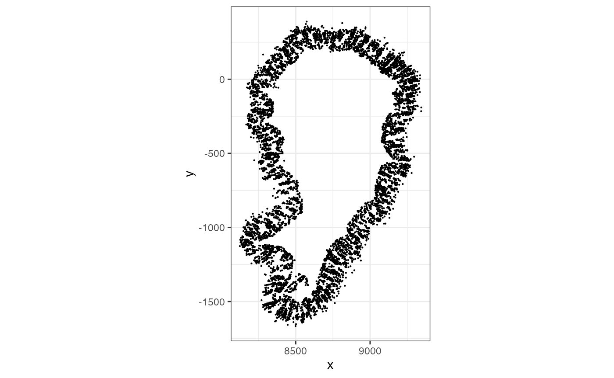
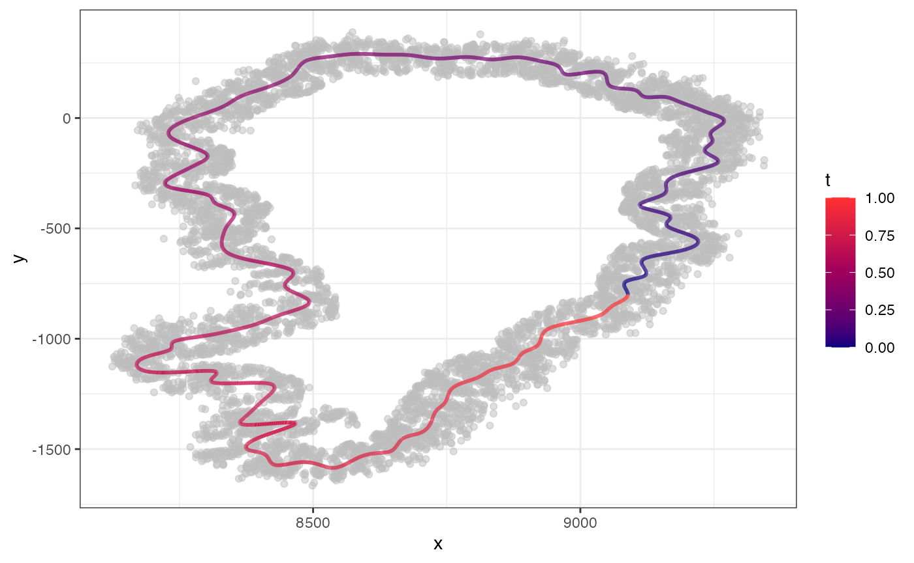
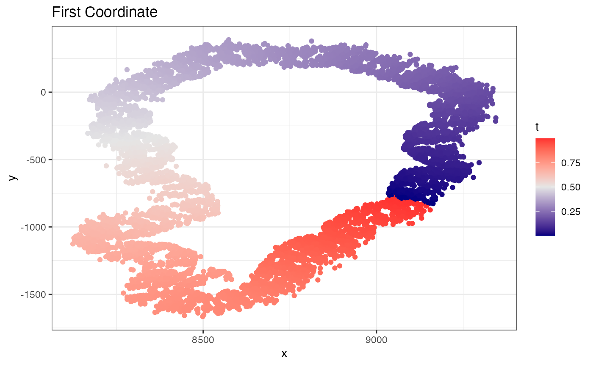
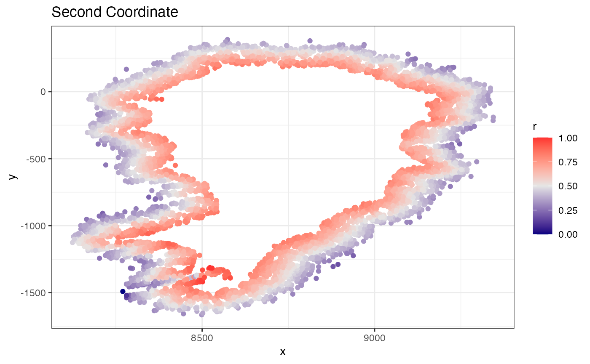
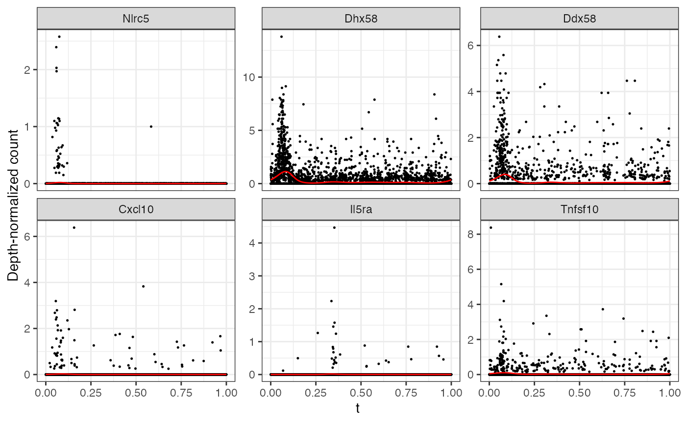
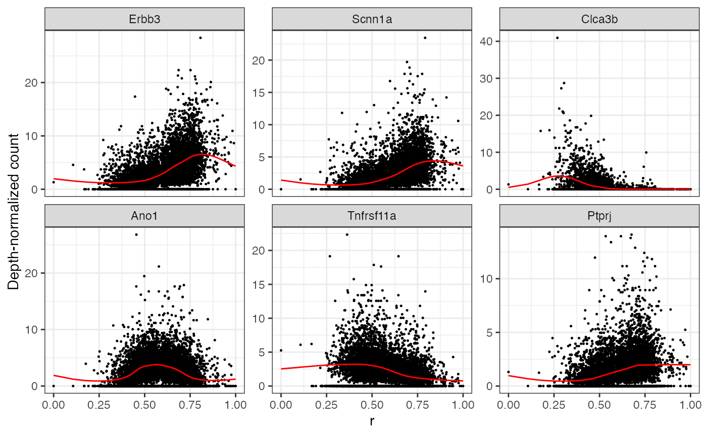
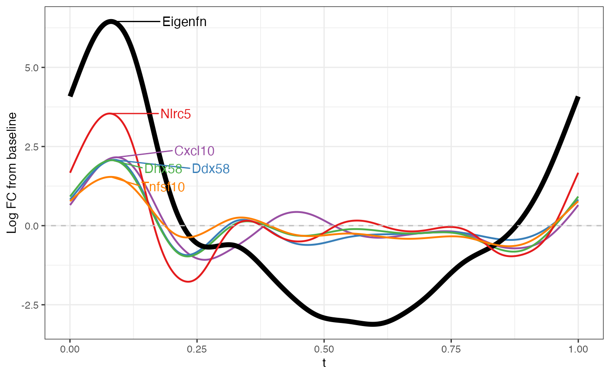
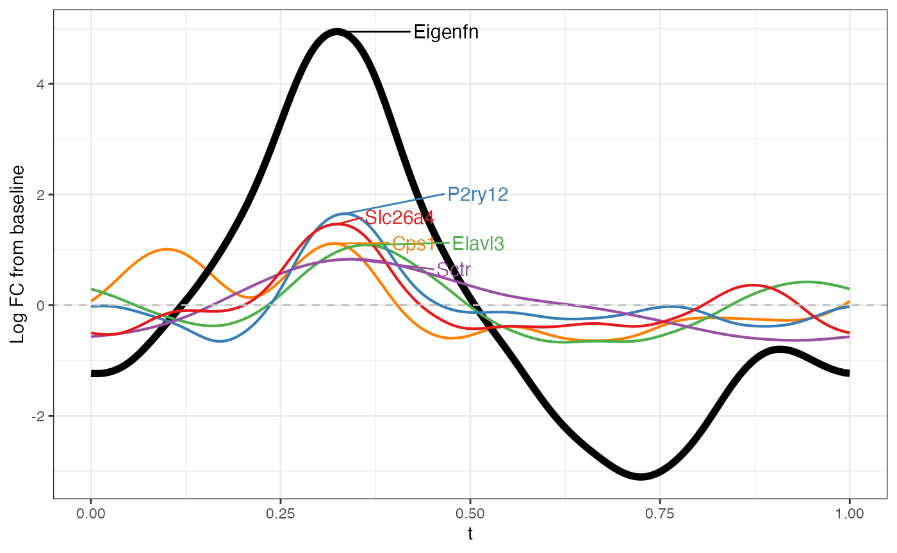

# MERFISH Mouse Mucosa

This example uses a small mouse mucosa data set included with
`MorphoGAM`. The coordinate file contains one row per cell and two
spatial coordinate columns. The count file contains genes as rows and
cells as columns.

``` r

library(MorphoGAM)
library(tidyverse)
```

``` r

coords_file <- system.file(
  "extdata",
  "mouse_mucosa",
  "mucosa_sub_coords.csv",
  package = "MorphoGAM",
  mustWork = TRUE
)

counts_file <- system.file(
  "extdata",
  "mouse_mucosa",
  "counts_sub_mucosa.rds",
  package = "MorphoGAM",
  mustWork = TRUE
)

xy <- read.csv(coords_file, row.names = 1, check.names = FALSE)
xy <- as.matrix(xy)
storage.mode(xy) <- "double"

Y <- readRDS(counts_file)
Y <- as.matrix(Y)
storage.mode(Y) <- "double"
```

``` r

xy_df <- as.data.frame(xy)
colnames(xy_df) <- c("x", "y")

ggplot(xy_df, aes(x = x, y = y)) +
  geom_point(size = 0.1) +
  coord_fixed() +
  theme_bw()
```



The mucosa in this example is approximately loop-shaped, so we ask
[`CurveFinder()`](https://phillipnicol.github.io/MorphoGAM/reference/CurveFinder.md)
to estimate a closed curve and use a smaller neighborhood size.

``` r

curve_fit <- MorphoGAM::CurveFinder(
  xy,
  knn = 14, #Value used in paper, use k = "auto" for automatic
  loop = TRUE
)

#Plot the fit and two coordaintes
curve_fit$curve.plot
```



``` r

curve_fit$coordinate.plot
```



``` r

curve_fit$residuals.plot
```



Next, we fit a smooth cyclic effect along the loop coordinate `t` and a
radial smooth effect for distance from the curve.

``` r

mgam <- MorphoGAM::MorphoGAM(
  Y,
  curve.fit = curve_fit,
  design = y ~ s(t, bs = "cc") + s(r, bs = "cr")
)
#> ================================================================================
```

Genes with large `peak.t` values have a strong fitted change along the
loop coordinate.

``` r

top_t_genes <- rownames(mgam$results)[
  order(mgam$results$peak.t, decreasing = TRUE)[1:6]
]

MorphoGAM::plotGAMestimates(
  Y,
  genes = top_t_genes,
  curve_fit = curve_fit,
  mgam_object = mgam,
  nrow = 2
)
```



We can similarly inspect genes with large radial variation.

``` r

top_r_genes <- rownames(mgam$results)[
  order(mgam$results$range.r, decreasing = TRUE)[1:6]
]

MorphoGAM::plotGAMestimates(
  Y,
  genes = top_r_genes,
  curve_fit = curve_fit,
  mgam_object = mgam,
  type = "r",
  nrow = 2
)
```



Now we can make the functional PCA plot to see the dominant modes of
spatial variation:

``` r

MorphoGAM::plotFPCloading(
  mgam,
  curve.fit = curve_fit,
  type = "t",
  L=1 #First component
)
```



``` r


MorphoGAM::plotFPCloading(
  mgam,
  curve.fit = curve_fit,
  type = "t",
  L=2 #Second component
)
```


